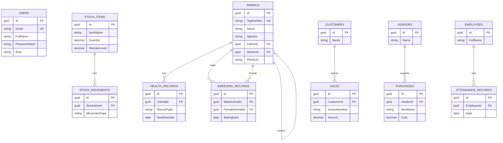

# ERD

```mermaid
erDiagram
  USERS {
    guid Id PK
    string Email UK
    string FullName
    string PasswordHash
    string Role
  }
  ANIMALS {
    guid Id PK
    string TagNumber UK
    string Name
    string Species
    guid FatherId FK
    guid MotherId FK
    string PhotoUrl
  }
  HEALTH_RECORDS {
    guid Id PK
    guid AnimalId FK
    string RecordType
    date NextDueDate
  }
  BREEDING_RECORDS {
    guid Id PK
    guid MaleAnimalId FK
    guid FemaleAnimalId FK
    date MatingDate
  }
  STOCK_ITEMS {
    guid Id PK
    string ItemName
    decimal Quantity
    decimal ReorderLevel
  }
  STOCK_MOVEMENTS {
    guid Id PK
    guid StockItemId FK
    string MovementType
  }
  CUSTOMERS {
    guid Id PK
    string Name
  }
  SALES {
    guid Id PK
    guid CustomerId FK
    string InvoiceNumber
    decimal Amount
  }
  VENDORS {
    guid Id PK
    string Name
  }
  PURCHASES {
    guid Id PK
    guid VendorId FK
    string ItemName
    decimal Cost
  }
  EMPLOYEES {
    guid Id PK
    string FullName
  }
  ATTENDANCE_RECORDS {
    guid Id PK
    guid EmployeeId FK
    date Date
  }
  ANIMALS ||--o{ HEALTH_RECORDS : has
  ANIMALS ||--o{ BREEDING_RECORDS : male
  ANIMALS ||--o{ BREEDING_RECORDS : female
  ANIMALS ||--o{ ANIMALS : father
  ANIMALS ||--o{ ANIMALS : mother
  STOCK_ITEMS ||--o{ STOCK_MOVEMENTS : has
  CUSTOMERS ||--o{ SALES : places
  VENDORS ||--o{ PURCHASES : supplies
  EMPLOYEES ||--o{ ATTENDANCE_RECORDS : has
```
